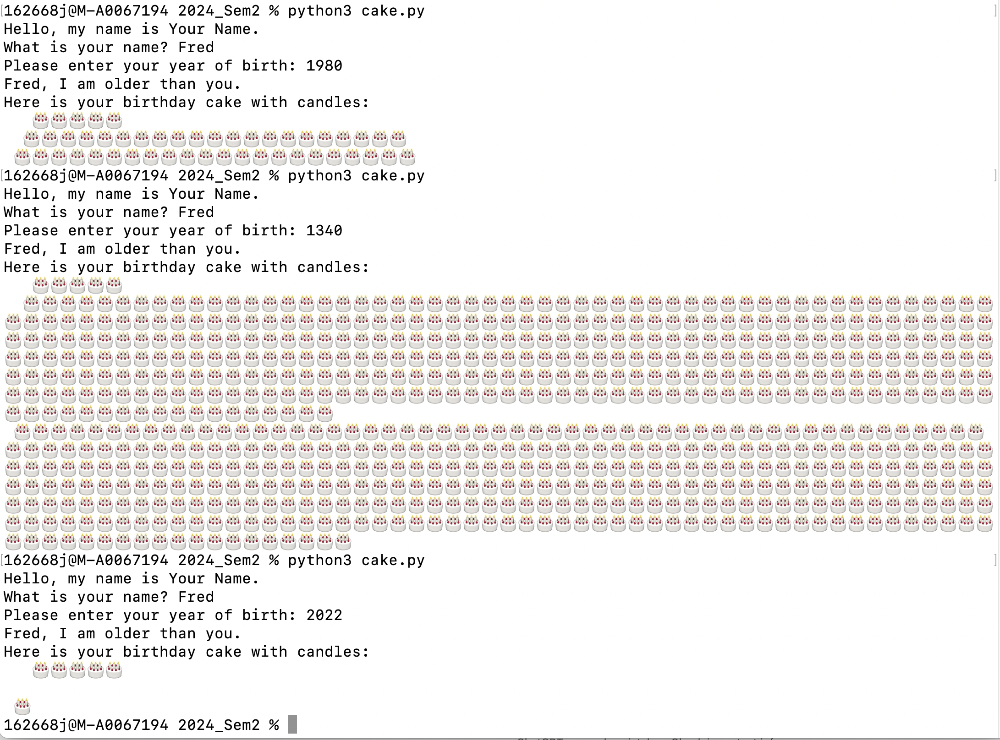

:::::::::::::::::::::::::::::::::::::: questions 

- Why should we care about code quality?
- How can we improve code quality?
- What tools are available to assist with creating and assessing code?

::::::::::::::::::::::::::::::::::::::::::::::::

::::::::::::::::::::::::::::::::::::: objectives

1. Understand the need for quality in software, how to assess it and how to achieve it
2. Have an awareness of formal approaches to managing and specifying projects
3. Understand the value of version control in software projects
4. Access and assess packages in the Python Package Index
5. Understand the basics of software testing and its importance

::::::::::::::::::::::::::::::::::::::::::::::::

### Introduction

We will go through a short programming challenge to see how we develop code with high quality, and use testing to show that it meets our requirements - for valid and invalid inputs.

The coding probelm we will use was a Practical Test 1 in a previous semester. 

``` python
myname = "Tim the Enchanter"
myyear = 898

print(f"Hello, my name is {myname}.")

for i in range(myyear//100):
    if i % 10 == 0:
        print("*", end="")
print()
```

Modify the code in PracTest1.py to: 

1. Correct any errors - get the given code working  (errors have already been removed)
2. Change myname and myyear to be your details 
3. Add code to ask the user their name and year of birth 
4. In an appropriate loop, test that the year is valid, ask them to re-enter the year and continue looping until it is valid
5. Based on the difference between your year and the user’s, print one of three comments – if you’re older, they’re older, or if you’re the same age. 
6. Print out a 3-layer birthday cake with the number of candles to match the user’s age. Candles are staggered in two layers (hint: i%2 for alternating)

```
SAMPLE OUTPUT
Hello, my name is Penny
What is your name? Sheldon
What year were you born? 1980
Birthday greetings, Sheldon the aged!
Here is a birthday cake with 44 candles!

 * * * * * * * * * *
*|*|*|*|*|*|*|*|*|*|
| | | | | | | | | |
####################
====================
####################
====================
####################
```

### Activity 1 - Program Logic

Before starting any coding, it is possible to get a feel for the "shape" of the program. This program will:

1. Ask for input
2. Validate it in a loop until the year is valid
3. Give one of three output options
4. Print out an ASCII birthday cake (in a series/nested loops).

We can then do a mapping from the program shape to the code structures required.

1. print/input
2. while loop - exit when year is valid
   - define invalid: could be year > 100 years ago, or >= the current year
4. if/elif/else - output text based on difference in birth years
5. calculate age
6. output cake based on age:
   - three loops for candles
   - loop for each layer (or strings) - width based on age
   - loop through alternating layers (cake and cream)

Make sure you understand how this matches up to the original specification. Sometimes a quick bit of coding can help you understand the problem - it will expose the parts of the problem you don't understand.

You might want to implement a solution to this in Python. Prehaps leaving out the cake printing, as that can take a while... a cake of the correct width without candles is enough for this activity.

### Activity 2 - Test Logic

The birthday cake scenario has **one user input: birth year** that affects the text that is output, and the size of the cake. If an invalid year is entered, the code will loop until it is valid. 

In the lecture, we introduced a Test Plan - a table where we can systematically define input combinations and the expected outputs. This could be completed before any code is written. Then, the code can be tested against the Test Plan, and the final column **Pass/Fail** completed with respect to the **Expected Result** column.

|Test # | Variable1 | Variable2 | Expected result | Pass/Fail |
|-------|----------|----|----|-----| 
| 1 | value1 | value2 | result1 | P/F |
| 2 | value3 | value4 | result2 | P/F |
| 3 | value4 | value6 | result3 | P/F |
| ... | ... | ... | ... | ... |


#### Writing a test plan: Testing... testing...

Looking at the birthday cake code, what inputs could you explore across a range of test cases to see if it is working correctly? Consider valid and invalid values, as well as values that produce the three variations of output text. 

Write a Test Plan for the birthday cake scenario. It should include:

- variables myyear and youryear
- youryear - invalid low
- youryear - invalid high
- valid and younger
- valid and older
- valid and same age

### Activity 4 - Test your birthday cake code

Based on the Test Plan you created in the previous activity, test the code you wrote for the birthday cake scenario.

Did you pass all the tests? Common issues might be:

- incorrect calculation of age
- not converting birth year to an integer
- outputting the wrong message
- incorrect validation (letting invalid values through, or flagging valid values as invalid)
- If you printed the cake:
   - wrong size cake - width should equal age
   - not enough layers - should be cake/cream/cake/cream/cake
   - candle problems - need to have age # flames (*), age # of candles (|) and spaces elsewhere 

Some of these will show as an individual test fail, while others will affect many test results. Finding the root cause of an error is a skill that develops with experience. 

Whether your testing is formal or informal, a systematic approach will help you to diagnose problems more quickly. It's also recommended that you test regularly, so you can see and fix issues early.  

### Activity 5 - Hello generative AI

Take the scenario description from the start of the practical and feed it into a generative AI tool, e.g. chatGPT. Copy the code into a python file in your Prac09 directory. You can call it cakeGPT.py.

Look through the code to see if there are obvious errors. Below is an example of cakeGPT.py code:

``` python
# Update the variables with your details
myname = "Your Name"  # Change this to your name
myyear = 2023  # Change this to your current year

print(f"Hello, my name is {myname}.")

# Get user's name
user_name = input("What is your name? ")

# Get user's year of birth with validation
while True:
    try:
        birth_year = int(input("Please enter your year of birth: "))
        if birth_year > 0 and birth_year <= myyear:
            break
        else:
            print("Please enter a valid year of birth.")
    except ValueError:
        print("Invalid input. Please enter a numerical year.")

# Calculate age
user_age = myyear - birth_year

# Compare ages and print appropriate message
if user_age > (myyear - 898):
    print(f"{user_name}, you are older than me.")
elif user_age < (myyear - 898):
    print(f"{user_name}, I am older than you.")
else:
    print(f"Hey {user_name}, we are the same age!")

# Print a 3-layer birthday cake with candles
print("Here is your birthday cake with candles:")
for layer in range(3):
    if layer == 0:  # Top layer
        print("   " + "🎂🎂🎂🎂🎂")  # Adjust number of candles as needed
    elif layer == 1:  # Middle layer
        print("  " + "🎂" * (user_age // 2))  # Staggered candles
    else:  # Bottom layer
        print(" " + "🎂" * (user_age // 2 + user_age % 2))  # Staggered candles
```

Apart from the use of **break** - which we don't allow in this unit, there are *many* errors and mistakes on understanding the code requirements.

Some sample output:



Now use your Test Plan to check the cakeGPT code (from above, or from your own prompt)

Did the test plan find even more errors?

It's important to consider the risks when using generative AI. The code (and text) it produces will **look** appropriate and correct, however, it required a lot of proofing and may not include coding standards or other knowledge that may be implied in the scenario/specification.

### Activity 6 - Surprise packages

Across the semester, we have imported packages including matplotlib, numpy and random, and learnt how to write and import our own modules. The lecture explained the process to creating and listing our own packages in the **Python Package Index**.

In this activity, we'll vicit the Python Package Index to see the range of packages available, and develop our spidey-senses to know which packages are "safe" and which might be more risky.

Open the Python Package Index (PyPI) website in a web browser: [https://pypi.org](https://pypi.org) AS of this publishing date, there are 579,333 projects listed on PyPI.

Choose *browse projects* (under the search box) and then open the *topics* on the left to see the application areas. As an example, we can choose *Astronomy* under *Scientific/Engineering*. With that filter on, there should be over 1600 entries, sorted in order of Relevance, by default. 

Change the sorting to be by *Date Last Updated*. If you go to the last page in the listing, you'll see **chimera-python 0.1** has not been updated since May 12th 2008. Projects that have not been updated recently are of higher risk - noone is fixing errors or updating to new version of Python and any package dependencies. 

There are 20 projects listed per page. How many astronomy projects have been updated in the last week?

The version numbering also indicates the maturity of a project. Projects with a 0.1 or 0.2 versions are pre-release and are likely to change as they mature, get user feedback and errors are fixed. So choosing versions greater than 1.0 is recommended, 

In the lecture, some considerations were listed for reducing risk when choosing packages:

- Is it developed by an individual or community?
-  How responsive are the developers?
-  How recently has it been updated?
-  Does it depend on other packages that are neglected?

We'll look at a few examples...

---

**AgeanTools**

In amongst the Astronomy projects is one maintained by one of our guest lecturers: Dr Paul Hancock. With the astronomy filter on, put "Hancock" into the search and you'll find AegeanTools. Click on the Release History and you can see there have been ten releases over six years.

Clicking through to the project home on github [https://github.com/PaulHancock/Aegean](https://github.com/PaulHancock/Aegean) you can see more details, including that there have been five contriubtors to the project. Under issues, there are 123 closed and 16 open - showing the team has been quite responsive to issues flagged by users.

**pyuvdata**

You can search directly for the package name, or enter search terms for MWA and Murchison, which will focus on the available python softare related to the Square Kilometre Array pathfinder - [Murchison Widefield Array](https://www.mwatelescope.org). This package is written to support scientists using a lot of different radio-telescopes, and specifically mentions MWA. The github page lists 36 contributor and at the current date, the last update was four days ago. There are 549 closed issues and 93 open.

This package was chosen as an example as it has a long list of specific dependencies - packages that it needs installed to be able to run correctly. This can clash with other software installations... solutions can include python Environments and the use of tools such as Docker.

```
Required:
- astropy >= 6.0
- docstring_parser>=0.15
- h5py >= 3.4
- numpy >= 1.23
- pyerfa >= 2.0.1.1
- python >= 3.10
- pyyaml >= 5.4.1
- scipy >= 1.8
- setuptools_scm >= 8.1

Optional:
- astropy-healpix >= 1.0.2 (for working with beams in HEALPix formats)
- astroquery >= 0.4.4 (for enabling phasing to ephemeris objects using JPL-Horizons)
- hdf5plugin >= 3.2.0 (for enabling bitshuffle and other hdf5 compression filters in uvh5 files)
- lunarsky >=0.2.5 (for working with simulated datasets for lunar telescopes)
- novas and novas_de405 (for using the NOVAS library for astrometry)
- python-casacore >= 3.5.2 (for working with CASA measurement sets)

The numpy and astropy versions are important, so make sure these are up to date.
```

Under insights in the github repository, they list the above dependencies, and also 107 repositories that are **dependent** on pyuvdat. Python and github make it possible and somewhat straight forward to extend on the work of others.

**matplotlib**

One last example is matplotlib. According to its github repository, there have been 1,477 contributors and it is used by 1.3 million programmers.

Clicking through to the matplotlib website, there are many projects extending from matplotlib for various domains - geospacial, finance, astronomy and many more - [https://matplotlib.org/thirdpartypackages/](https://matplotlib.org/thirdpartypackages/).

---

Hopefully this exploration will help you to recognise which packages are safe to work with, and which might need to be avoided. Note that they are all **open source**, so you can see what is inside the code... but errors and malware may be hard to find.  The communities that develop and use packages usually keep these issues under control, as we all want to benefit from the sharing that PyPI (and github) provide.

### Submission

Update the README file to include all files created in this practical.

All of your work for this week’s practical should be submitted via Blackboard using
the Practical 09 link. This should be done as a single "zipped" file.
Submit the resulting file through Blackboard. (refer to Practical 00 or 01 for instructions
on zipping files.
 
There are no direct marks for these submissions, but they may be taken into account 
when finalising your mark for the unit. Go to the Assessment link on Blackboard and 
click on Practical 09 for the submission page.

### And that's the end of Practical 09!

::::::::::::::::::::::::::::::::::::: keypoints 

- There is a whole field, "Software Engineering", that deals with ensuring software quality. We have touched on some of the areas involved so that you are aware of them.
- Detailed coverage is beyond this unit, however, if you are involved in more complex software development in the future (client, team member, coder, tester) there are many resources available to support you.
- In all of our coding, we should consider software quality and ways to test our code to be confident it performs as intended.
- Tools that can support coding (version control, IDEs, co-pilot/genAI) can improve productivity and reduce risk of losing data/code
- WARNING: you will always need to check back that the code/system you are developing matches the **requirements** - a perfect system that doesn't solve the problem is worthless (actually it's worse than that, as all the tme and money spent in development has been wasted). 

:::::::::::::::::::::::::::::::::::::

:::::::::::::::::::::::::::::::::::::::::::::::: checklist

### Reflection
 
1. **Knowledge:** ?
3. **Comprehension**: ?
5. **Application**: ?
7. **Analysis**: ?
9. **Synthesis**: How does having a well-defined program and test design help with managing larger projects? (larger => longer duration, more coders)
10. **Evaluation**: You are leading a project which includes the development of code. The
programmers have asked to be able to use generative AI (e.g. ChatGPT/copilot) to help
them to develop code more quickly. What risks might that create for the project? What processes could you put in place to ensure the quality and correctness of the code??
    
::::::::::::::::::::::::::::::::::::::::::::::::

:::::::::::::::::::::::::::::::::::::::::::::::: challenge

For those who want to explore a bit more of the topics covered in this practical. Note that the challenges are not assessed but may form part of the prac tests or exam.

1. For a given programming scenario, go through the process of test driven development. Test accounts, past PT1?
   1. Set up a table for your test cases
   2. Write code for your tests cases
   3. Write code to implement the problem solution

::::::::::::::::::::::::::::::::::::::::::::::::
